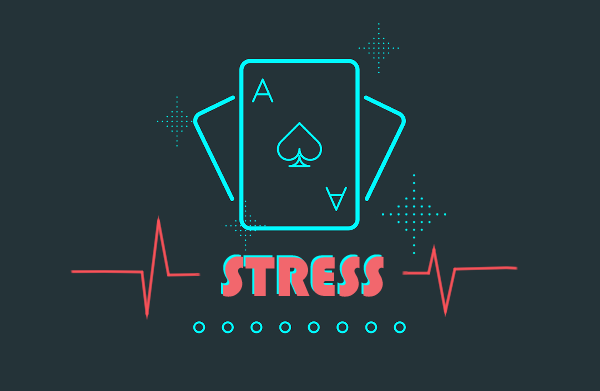
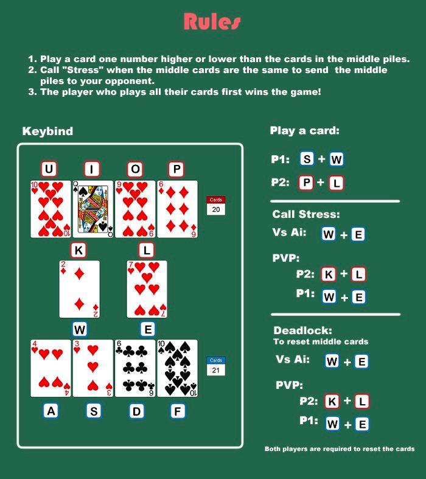

# Stress: The Card Game
---

Welcome to **Stress: The Card Game**. We've implemented a single and multiplayer experience for you, modelled after the original game. Either challenge our AI at three different difficulty levels, or pull an friend to fight! You'll need reflexes, pattern recognition and composure to win in this interactive game where time is of the essence! 

## **Rules**
---
### Objectives
Each player is given half the deck, 26 shuffled cards. **The objective of the game is get rid of your stack**. 

There are two piles in the center of board - you may play cards to either stack, that are either high or lower by ONE value than the current card.

However, only four of your cards are playable and visible to you at a time - play them to the center to reveal more of your stack!

Here's the highlight - **if both stacks show a card of the same number**, you can call **STRESS** to give both piles of cards to your opponent to put them at a disadvantage.

### Game States
Deadlocks may occur when either player cannot play a card. In single player, reset the stacks by calling **STRESS**. In multi player, both players have to call **STRESS** to agree to reset the stacks. 

## **Controls**
---
Refer to these keybinds! Each position on the board is **binded to a keystroke**. To play a card to either pile, press the key of your card and the key of the intended stack **simultaneously**. To call STRESS, press the keys of both piles at once!

## **Running Instructions**
---
1. Compile the source files

'./compile.bat'

2. Run the game

'./run.bat'

